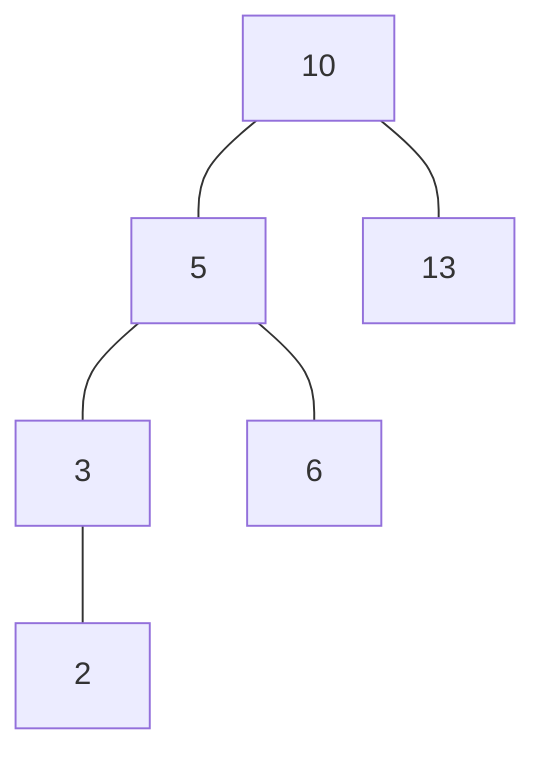
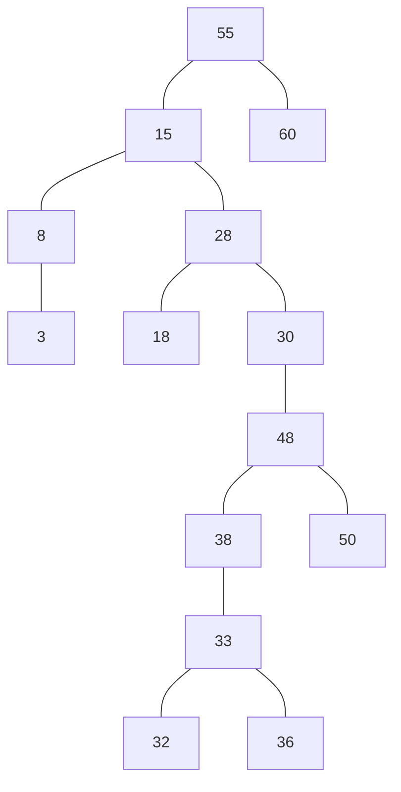
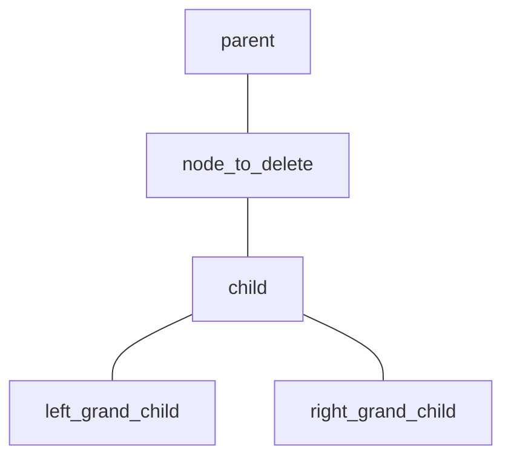

# 검색 트리

- [검색 트리](#검색-트리)
  - [구성](#구성)
    - [`record`](#record)
    - [`field`](#field)
    - [`Search Key` 또는 `key`](#search-key-또는-key)
  - [분류](#분류)
    - [한 노드에 몇 개의 자식 노드로 분기할 수 있는지에 따라 분류](#한-노드에-몇-개의-자식-노드로-분기할-수-있는지에-따라-분류)
    - [저장되는 장소에 따라 분류](#저장되는-장소에-따라-분류)
    - [`key`가 포함하는 `field`의 수에 따른 분류](#key가-포함하는-field의-수에-따른-분류)
  - [Binary Tree](#binary-tree)
    - [특징](#특징)
    - [시간 복잡도](#시간-복잡도)
      - [이진 검색 트리의 평균 검색 시간](#이진-검색-트리의-평균-검색-시간)
    - [features](#features)
      - [탐색](#탐색)
      - [삽입](#삽입)
      - [삭제](#삭제)
        - [`key_to_delete`가 리프 노드인 경우](#key_to_delete가-리프-노드인-경우)
        - [`key_to_delete`의 자식 노드가 한 개인 경우](#key_to_delete의-자식-노드가-한-개인-경우)
        - [`key_to_delete`의 자식 노드가 두 개인 경우](#key_to_delete의-자식-노드가-두-개인-경우)
        - [pseudo code](#pseudo-code)

## 구성

### `record`

- 개체에 대한 모든 정보를 포함

### `field`

- 주민번호, 이름, 주소, 전화 번호 등 `record`가 가진 각각의 정보를 나타내는 부분

### `Search Key` 또는 `key`

- 다른 레코드와 중복되지 않으면서 레코드를 대표할 수 있는 `field`. 가령,
  - 주민번로
  - 이름 & 집 전화번호 조합
- 검색 색인을 만들기 위해서는 레코드 대신 아래 두 정보만 있으면 된다
  - `key`
  - 해당 레코드가 저장된 위치 정보

## 분류

### 한 노드에 몇 개의 자식 노드로 분기할 수 있는지에 따라 분류

- 최대 두 개의 자식 노드 -> 이진 검색 트리
- 세 개 이상의 자식 노드 -> 다진 검색 트리

### 저장되는 장소에 따라 분류

- 검색 트리가 메인 메모리 내에 존재 -> 내부 검색 트리
- 검색 트리가 외부(주로 디스크)에 존재 -> 외부 검색 트리
  - 디스크 접근 시간이 검색 효율을 좌우

### `key`가 포함하는 `field`의 수에 따른 분류

- `key`가 하나 -> 일차원 검색 트리
  - 이진 검색 트리
  - 다진 검색 트리
  - B-트리
  - AVL-트리
  - 레드 블랙 트리
- `key`가 두 개 이상 -> 다차원 검색 트리
  - KD-트리
  - KDB-트리
  - R-트리

## Binary Tree

### 특징

- 각 노드는 하나의 `key`를 가지며, `key`는 서로 달라야 한다
- 최상위 레벨에 루트 노드가 있고, 각 노드는 최대 두 개의 자식 노드 갖는다
- `key`는
  - 자신의 좌측에 있는 모든 노드의 `key`보다 크다
  - 자신의 우측에 있는 모든 노드의 `key`보다 작다
- 이진 검색 트리는
  - 삽입 순서에 따라 모양이 결정되고,
  - 대체로 좌우 균형이 잘 잡힌 검색 트리이며,
  - 좌우 균형이 잘 잡히면 검색 트리의 깊이가 깊어지지 않아서 검색 효율이 높아진다

### 시간 복잡도

- 이상적으로 균형이 잡히면, 최악의 경우라 하더라도 $\Theta(logn)$
- 가장 나쁘게 기울면 $\Theta(n)$
- 가능한 모든 삽입 순서에 따른 이진 검색 트리를 모두 고려하면 평균 검색 시간은 $\Theta(logn)$
- 삽입은 실패하는 검색 후 상수 시간의 후처리를 하므로, 점근적 수행 시간은 검색과 동일

#### 이진 검색 트리의 평균 검색 시간



- 이진검색 트리 모양은 `key`가 n개라는 것보다는, `key`들의 상대적인 크기(값)에 따라 결정
- n개의 `key`가 만들 수 있는 상대적인 순서는 모두 $n!$가지 경우의 수

> 키의 총수가 n개인 모든 이진검색 트리의 평균 `IPL`은 $O(logn)$

- 이진 트리에서 각 노드의 깊이를 더한 것을 내부 경로 길이(`IPL`, Internal Path Length)라고 한다.
  - 뎁스별로 1, 2, 3, 4,가 된다
  - $1 + (2\times2) + (3\times3) + (4\times1) = 18$
  - $18\div7\text{(=노드의 수)} = 2.6$: 임의의 키를 검색하는 데 평균 2.6번의 비교가 필요

$$
D(n) = \frac{1}{n}\sum_{i=0}^{n-1}(D(i) + D(n-i-1)) + n \\
%% D(i)와 D(n-i-1)에 0, 1, 2 ... n-1을 대입해 보면
%% (D(0) + D(n-1)), (D(1) + D(n-2)) ... (D(n-1) + D(0))
%% 그렇다면 2번 더하는 것과 같다
D(n) = \frac{2}{n}\sum_{i=0}^{n-1}D(i) + n
$$

### features

- 탐색
- 삽입
- 삭제

#### 탐색

```js
/**
 * @property root_node 검색할 트리의 루트 노드
 * @property root_node.key 루트 노드의 `key`. 검색할 `key`와 비교하게 된다
 * @property root_node.left 루트 노드의 좌측 자식 노드. 기본값은 NULL
 * @property root_node.right 루트 노드의 우측 자식 노드. 기본값은 NULL
 * @property key_to_search 검색하고자 하는 key
 */
function binary_tree_search(root_node, key_to_search) 
{
  if(
    root_node == NULL OR
    root_node.key == key_to_search
  ) return root_node
 
  // 값이 더 작다면 좌측에 있다는 의미이며, `root_node.left`에서 다시 탐색 시작
  if(key_to_search < root_node.key) return binary_tree_search(root_node.left, key_to_search)

  // 값이 작지 않다면 우측에 있다는 의미이며, `root_node.right`에서 다시 탐색 시작
  return binary_tree_search(root_node.right, key_to_search)
}
```

#### 삽입

- 삽입하려면 우선 해당 키가 없어야 한다, 즉 실패하는 검색을 한번 수행해야 한다
- 이진 검색 트리의 모양은 원소들이 삽입되는 순서에 따라 결정

```js
/**
 * @property root_node 검색할 트리의 루트 노드
 * @property root_node.key 루트 노드의 `key`. 검색할 `key`와 비교하게 된다
 * @property root_node.left 루트 노드의 좌측 자식 노드. 기본값은 NULL
 * @property root_node.right 루트 노드의 우측 자식 노드. 기본값은 NULL
 * @property key_to_insert 삽입하려고 하는 key
 */
function binary_tree_insert(root_node, key_to_insert)
{
  if(root_node == NULL) {
    // 검색이 실패했다면 삽입하려는 노드가 없다는 의미이므로,
    // 새로운 노드를 생성해서 리턴한다
    new_node.key = key_to_insert
    new_node.left = NULL
    new_node.right = NULL
    return new_nocde
  }

  // 1. root_node.left가 NULL? 새로운 노드가 생성되어서 root_node.left에 삽입된다
  // 2. root_node.left가 NOT NULL? root_node.left 그 자체가 다시 돌아온다
  if(key_to_insert < root_node.key) {
    root_node.left = binary_tree_insert(root_node.left, key_to_insert)
    // ^^^^^^^^^^^                      ^^^^^^^^^^^^^^
    // 재귀 함수로 넣은 노드를 그대로 받아서 다시 그 자신을 리턴해줘서 그대로 넣어준다
    return root_node
  }

  root_node.right = binary_tree_insert(root_node.right, key_to_insert)
  return root_node
}
```

#### 삭제



##### `key_to_delete`가 리프 노드인 경우

> `key_to_delete` 노드를 버린다  
>
> ex1) `18` 노드를 삭제하려면 `18` 노드를 가리키고 있던 포인터인 `28.left`를 `NULL`로 바꿔주면 된다

##### `key_to_delete`의 자식 노드가 한 개인 경우

> `key_to_delete`의 부모 노드가 `key_to_delete`의 자식 노드를 직접 가리키도록 한다  

삭제하려는 노드의 자식 노드가 하나이므로, 삭제하려는 노드를 가리키는 부모 노드의 포인터를 해당 자식 노드와 연결을 하면 된다

지우려는 자식 노드가 하나인 경우 그 자식 노드가 작으면 left, 크면 right에 위치하는데, 부모의 부모 노드와의 관계도 같게 유지가 된다.



> ex1) `30` 노드를 삭제하려면 `30` 노드를 가리키고 있던 포인터인 `28.right`를 `30`의 유일한 자식 노드 `48`로 치환한다  
> ex2) `38` 노드를 삭제하려면 `38` 노드를 가리키고 있던 포인터인 `48.left`를 `38`의 유일한 자식 노드 `33`으로 치환한다

##### `key_to_delete`의 자식 노드가 두 개인 경우

> 1. `key_to_delete`의 **우측** 서브 트리의 최소 원소 노드 `least_node`를 삭제  
> 2. `least_node`노드를 `key_to_delete` 자리에 놓는다

자식 노드가 한 개인 경우보다 복잡한데, 삭제하려는 노드를 가리키는 부모 노드의 포인터는 하나인데, 삭제하려는 노드의 자식 노드가 두 개이므로, 삭제하려는 노드의 부모 노드의 포인터가 두 자식 노드 중 어떤 노드를 가리켜야 하는지 알 수 없기 때문이다.

**삭제하려는 노드 주변의 구조는 그대로 유지**해야 한다

- **삭제하려는 노드 자리에 옮겨 놓아도 이진 검색 트리의 성질을 전혀 꺠지 않는 원소**를 찾아야 한다
  - 좌측 서브 트리에서 가장 큰 노드(삭제하려는 노드의 직전 노드)
  - 우측 서브 트리에서 가장 작은 원소(삭제하려는 노드의 직후 노드)

여기서 `삭제하려는 노드의 직후 노드`는 절대 왼쪽 자식 노드를 가질 수 없다.
삭제하려는 노드의 우측 자식 노드에서 시작해서 좌측(작은 값)의 리프 노드에 도달하면 그것이 직후 노드이기 때문  
직후 원소의 삭제는 "`key_to_delete`가 리프 노드인 경우" 또는 "`key_to_delete`의 자식 노드가 한 개인 경우" 둘 중 하나의 경우에 속하게 된다

##### pseudo code

```js
/**
 * @property root_node 검색할 트리의 루트 노드
 * @property root_node.key 루트 노드의 `key`. 검색할 `key`와 비교하게 된다
 * @property root_node.left 루트 노드의 좌측 자식 노드. 기본값은 NULL
 * @property root_node.right 루트 노드의 우측 자식 노드. 기본값은 NULL
 * @property key_to_delete 삭제하려고 하는 key
 * @property parent_key_to_delete 삭제하려고 하는 key의 부모 노드의 key
 */
function binary_search_delete(root_node, key_to_delete, parent_key_to_delete)
{
  if()
}
```
